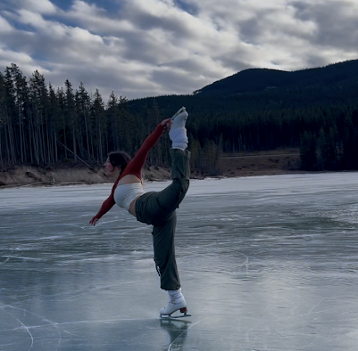
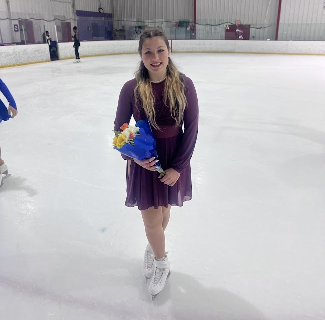
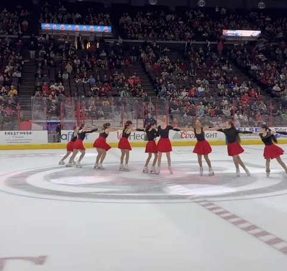

# Figure Skating

Woah, you've made it pretty far on my site! Since you're here, I'll let you in on a little secret: one of my favorite hobbies is figure skating. I hope this gives you a little more insight into who I am.

I currently skate for the Illinois Intercollegiate Figure Skating Team in Excel Preliminary Plus. Back in high school, I was part of the Queen City Figure Skating Club. If you're curious, you can check out my most recent solo performance to "La Fac De Lettres" by Jacqueline Taïeb.

## Media

### Skating on a lake in Alberta, Canada.

### After my most recent show.

### Skating Synchro in the Cincinnati Cyclones halftime show.

