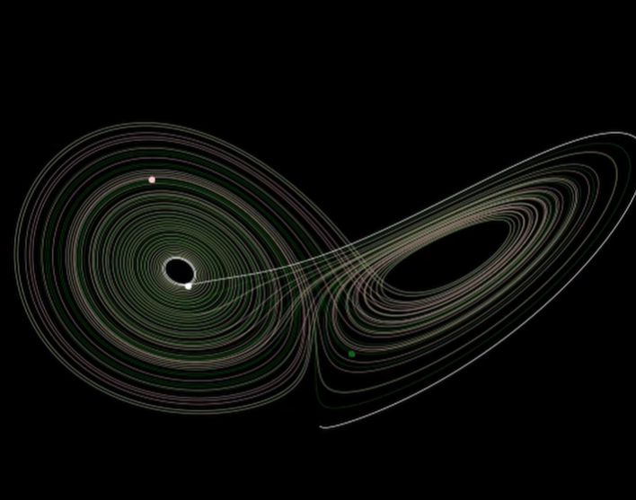
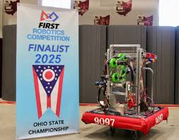

# Projects

Hello! Get to know some of my personal projects!

## Illinois Space Society 

Active member of the Illinois Space Society working on the E-Hardware subteam for Spaceshot. My role involes designing and creating PCBs to handle live data, telemetry, and in-flight events. Our next rocket's ancipitated launch is November 8th, 2025.

## Modeling attractors using dynamical systems, Python, and Matplotlib

This project focused on the chaotic and unpredictable behavior of the Lorenz Attractor, a classic example of deterministic chaos. I used Python to visualize the "butterfly effect", demonstrating how a tiny initial difference leads to widely divergent paths over time. Then after quantifing this divergence, and showing how the distance between trajectories grows exponentially, there was an unexpected characteristic oscillatory frequency. Suggesting an underlying rhythm within the chaotic system, which should not exist in a dynamical system.

If you would like to read more, here is the [GitHub link](https://github.com/AzaleaSh/Attractors).

## MachBusters Robotics

Wow! Here is our robot from the robotics team I lead throughout high school. Interesting techincal notes that this features a custom-built Swerve Drive chassis for omnidirectional movement. There is custom-designed electrical and control systems, including a Limelight camera for autonomous targeting. The robot is capable of scoring both elements and performing a telescoping climb to suspend itself at the end of a match based on the 2025 FRC game, [Reefscape](https://www.youtube.com/watch?v=YWbxcjlY9JY).

[back](./)
